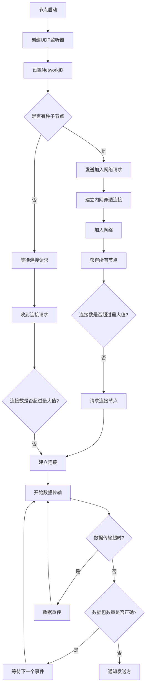

# 架构设计与原理

---

## 总体架构

`Q2P` 的架构基于 UDP 协议实现点对点通信，采用事件驱动模式，核心设计目标是简化网络通信的复杂性，同时提供高效、可靠的传输机制。项目的架构主要由以下几个部分组成：

1. **Peer（节点）**  
   每个节点（Peer）负责管理与其他节点的连接和数据传输。节点通过 UDP 协议与其他节点进行通信，每个节点可以作为客户端或服务器角色，参与不同的网络事件。

2. **事件驱动**  
   `Q2P` 使用事件驱动模式管理网络事件。每个事件都会触发相应的回调函数，用于处理特定的通信任务。例如，节点加入网络时会触发 `JOIN` 事件，节点连接其他节点时会触发 `CONNECT` 事件。

3. **连接管理**  
   节点之间的连接是通过 UDP 协议进行的。每个节点在启动时会指定一个监听端口，并通过 UDP 连接其他节点。当一个节点想要加入网络时，它会向网络中的其他节点发送连接请求，触发相应的连接事件。

4. **数据传输与分片**  
   为了确保高效的大数据量传输，`Q2P` 支持数据分片传输。当数据量超过 UDP 数据包的最大限制时，数据会被拆分为多个小包进行传输。接收端会将这些数据包合并为原始数据，并交给应用层处理。

## 工作原理

### 节点连接流程

1. **节点启动**  
   每个节点在启动时，会首先创建一个 UDP 监听器，等待来自其他节点的连接请求。节点可以通过设置 `NetworkID` 来区分不同的 P2P 网络。

2. **加入网络**  
   节点通过向已知的远程种子节点（Seed Nodes）发送 `JOIN` 请求，加入到网络中。这个请求会携带节点的 `NetworkID`，标识该节点所处的网络。

3. **连接请求**  
   节点可以发送 `CONNECTREQUEST` 请求，试图与目标节点建立连接。如果目标节点接受连接请求，它会发送 `CONNECT` 消息来确认连接。

4. **连接确认**  
   在连接建立之后，双方节点会通过 `CONNECTED` 消息确认连接成功，之后可以开始数据传输。

### 数据传输机制

`Q2P` 支持将数据分片并通过 UDP 发送。每个数据包都会带有一个序号（SYN），接收方根据这些序号将收到的数据包重新组装。为了确保数据传输的可靠性，`Q2P` 还实现了以下功能：

- **数据分片**：当数据包超过最大传输大小时，数据会被拆分成多个片段（每个片段最大为 484 字节），每个片段都有一个唯一的序号。
- **重试机制**：如果接收方在规定时间内未收到完整的数据，发送方会重新发送丢失的片段。
- **超时控制**：如果数据传输超时，系统会标记为传输失败，并通过 `TRANSPORT_FAILED` 消息通知相关节点。

### 事件与回调

`Q2P` 中的事件分为不同的类型，每个事件都可以触发相应的回调。以下是一些常见的事件类型及其说明：

- **JOIN**：节点请求加入网络。
- **TOUCHREQUEST**：节点请求与目标节点建立连接。
- **TOUCH**：节点触发连接建立事件。
- **TOUCHED**：目标节点响应连接请求。
- **CONNECTREQUEST**：节点请求连接其他节点。
- **CONNECT**：节点接受连接请求。
- **CONNECTED**：连接成功建立。
- **TRANSPORT**：节点进行数据传输。
- **TRANSPORT_FAILED**：数据传输失败。
- **TEST**：用于测试的事件。

### 数据包结构

数据包的结构是 `Q2P` 协议的核心部分，数据包分为头部和数据部分。头部包含了协议版本、事件类型、节点的 `NetworkID` 等信息。数据部分包含了实际传输的数据。

数据包的格式如下：

| 字段          | 描述                     | 长度（字节）  |
| ------------- | ------------------------ | ------------- |
| `NetworkID`   | 网络标识符               | 2             |
| `Event`       | 事件类型（如 JOIN、CONNECT 等） | 2             |
| `Data`        | 数据部分（可能包含附加数据，如 IP 地址、消息等） | 可变长度     |

## 连接与数据传输流程图

以下是节点之间的连接和数据传输流程图，展示了从节点加入网络到数据传输的全过程。

---

## 跳转

继续阅读了解更多关于系统模块与功能逻辑的细节：[模块功能与逻辑](03_modules_and_logic.md)。
